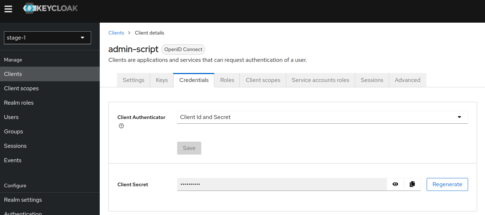

# Typescript Keycloak Authorization Validator.
A small tool based on NodeJS / Typescript to track and synchronize client authorizations in Keycloak.

<!-- TOC -->
* [Typescript Keycloak Authorization Validator.](#typescript-keycloak-authorization-validator)
  * [Disclaimer](#disclaimer)
  * [Purpose](#purpose)
  * [Q&A](#qa)
    * [Why Typescript?](#why-typescript)
  * [How does it work?](#how-does-it-work)
    * [Config File Template](#config-file-template)
  * [How to run for development](#how-to-run-for-development)
    * [Run docker-compose.yaml](#run-docker-composeyaml)
    * [Adjust config.json file](#adjust-configjson-file)
      * [Login to keycloak instance and generate client secret](#login-to-keycloak-instance-and-generate-client-secret)
    * [Run the script](#run-the-script)
<!-- TOC -->

## Disclaimer
I'm not a typescript developer, I'm mainly trying things and explore while trying to solve an issue.


## Purpose
If you have worked a bit with Keycloak authorization in multiple staging (dev -> qua -> prod for example).  
You might have noticed that it's not an easy task to synchronize authorization across staging (export / import not always working as expected).  
In this project, I'm trying to create a basic tool to synchronize keycloak authorization across stages.


## Q&A
### Why Typescript?
Why not

Actually, I first planned to do it in Go. But I first did it in Typescript to train and try things.  
Also, the idea was to be able to run this tool in a pipeline in charge of deploying a Frontend application using authorization system.    

_A Go version of this tool is planned._


## How does it work?
Currently supported elements:
- resources
- permissions

You have to create a `config.json` file in `src/config` folder where you will define the `mode` and different `stages`.
- **mode**: `report` or `synchronize`
  - `report`: it will just generate for each stage json file reports (un-synchronized resources and permission) in `src/report` folder.
  - `synchronize`: it will both generate reports (before synchronization) and make api request to synchronize resources and permissions across stages.
- **stage**: different stage (dev, trn, prod)
  - **stage**: number for the stage level
  - **stage_name**: name for the stage (used for reports)
  - **hostname**: hostname of the keycloak instance
  - **realm**: realm to synchronize authorizations
  - **clients**: list of clients to synchronize
  - **admin_user_client**: the service-account admin for api request
    - **client_id**: name
    - **client_secret**: secret


It will always compare `stage n` with `stage n + 1` following the config file order.  
It will compare and synchronize clients with the same name across stages.

### Config File Template
You can find a `template.config.json` file under `src/config` folder. You can copy / paste it with the name `config.json` and adjust it.

```json
{
  "mode": "report",
  "stages": [
    {
      "stage": 0,
      "stage_name": "stage-1",
      "hostname": "KEYCLOAK_HOSTNAME",
      "realm": "KEYCLOAK_REALM",
      "clients": ["KEYCLOAK_CLIENTS"],
      "admin_user_client": {
        "client_id": "KEYCLOAK_SERVICE_ACCOUNT_CLIENT_ID",
        "client_secret": "KEYCLOAK_SERVICE_ACCOUNT_CLIENT_SECRET"
      }
    },
    {
      "stage": 1,
      "stage_name": "stage-2",
      "hostname": "KEYCLOAK_HOSTNAME",
      "realm": "KEYCLOAK_REALM",
      "clients": ["KEYCLOAK_CLIENTS"],
      "admin_user_client": {
        "client_id": "KEYCLOAK_SERVICE_ACCOUNT_CLIENT_ID",
        "client_secret": "KEYCLOAK_SERVICE_ACCOUNT_CLIENT_SECRET"
      }
    },
    {
      "stage": 2,
      "stage_name": "stage-3",
      "hostname": "KEYCLOAK_HOSTNAME",
      "realm": "KEYCLOAK_REALM",
      "clients": ["KEYCLOAK_CLIENTS"],
      "admin_user_client": {
        "client_id": "KEYCLOAK_SERVICE_ACCOUNT_CLIENT_ID",
        "client_secret": "KEYCLOAK_SERVICE_ACCOUNT_CLIENT_SECRET"
      }
    }
  ]
}
```

## How to run for development
### Run docker-compose.yaml
First you will have to run the given docker-compose with your favorite tool.  
- **docker**: `docker compose up -d`
- **podman**: `podman compose up -d`

It will spawn 3 keycloak 23.0.7 containers (you can comment to reduce it) with testing realm:
- `http://localhost:8081` -> stage-1
- `http://localhost:8082` -> stage-2
- `http://localhost:8083 ` -> stage-3

### Adjust config.json file
You can use this given pre-configured config file that I'm using. Put it in `src/config` folder as `config.json`.

```json
{
  "mode": "report",
  "stages": [
    {
      "stage": 0,
      "stage_name": "dev",
      "hostname": "http://localhost:8081",
      "realm": "stage-1",
      "clients": ["authorizer"],
      "admin_user_client": {
        "client_id": "admin-script",
        "client_secret": ""
      }
    },
    {
      "stage": 1,
      "stage_name": "qua",
      "hostname": "http://localhost:8082",
      "realm": "stage-2",
      "clients": ["authorizer"],
      "admin_user_client": {
        "client_id": "admin-script",
        "client_secret": ""
      }
    },
    {
      "stage": 2,
      "stage_name": "prod",
      "hostname": "http://localhost:8083",
      "realm": "stage-3",
      "clients": ["authorizer"],
      "admin_user_client": {
        "client_id": "admin-script",
        "client_secret": ""
      }
    }
  ]
}
```

#### Login to keycloak instance and generate client secret
As client secrets are not exported, you will have to generate them for each instance.   
To log in to the local keycloak instance, use this super secure credentials: 
- username: `admin`
- password: `admin`

Go to the corresponding realms (`stage-1, stage-2, ...`) and to `admin-script` client.  
There, you will have to `regenerate` secret and copy/paste it into the `client_secret` of the corresponding stage in `config.json`.   



### Run the script
First, install what is needed:
- Node (using v20.9)
- Yarn (using 1.22.19)

Then, you will have to install the dependencies with `yarn install`

To run the script, just run `yarn run start`
